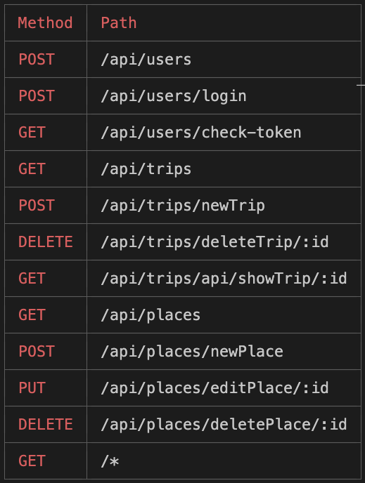

## Premise: 

Plan your trip with Tripplan!
This is a trip planning app, a place where you can create trips,destinations and see the distance between destinations. Plan your trip conveniently with Tripplan.
 
Happy planning!

## Getting started:
[Link to the APP](https://tripnote.herokuapp.com//)

[Link to Trello board](https://trello.com/b/5EkXJrqq/sei-59project-04)

## User Story:

- Users should be able to create their own profiles to get access to their trip plans.
- Users should be able to create, edit and delete their own trip plans.
- Users should also be able to check trip distance and time between destinations.

## Wireframes:
 

Concept idea for the homepage.

Concept ideas for the index page.

Concept ideas for the create and edit page.

Finished homepage.

Finished notes page.

Finished todos page.

## The ERD: 

The proposed ERD for the project *(entity relationship diagram)*

## Route Table:
 
 
List of the routes used.

## Technologies Used:
- JavaScript
- Css
- Mongodb
- Node.js
- Express
- React
- MERN

## MVP Requirements:
- Be a full-stack MERN application.
- Connect to and perform data operations on a Mongo database.
- If consuming an API, have at least one data entity (Model) in addition to the built-in User model. The related entity can be either a one-to-many (1:M) or a many-to-many (M:M) relationship.
- If not consuming an API, have at least two data entities (Models) in addition to the built-in User model. It is preferable to have at least one one-to-many (1:M) and one many-to-many (M:M) relationship between entities/models.
- Have full-CRUD *(Create, Read, Update, and Delete)* data operations across any combination of the app's models (excluding the User model). 
- Authenticate users using token-based authentication.
- Implement authorization by restricting access to the Creation, Updating & Deletion of data resources.
- Be deployed online using Heroku. Presentations must use the deployed application.

## Future goals:
- [x] Connect an api to add todos onto a calendar
- [ ] Dark mode

