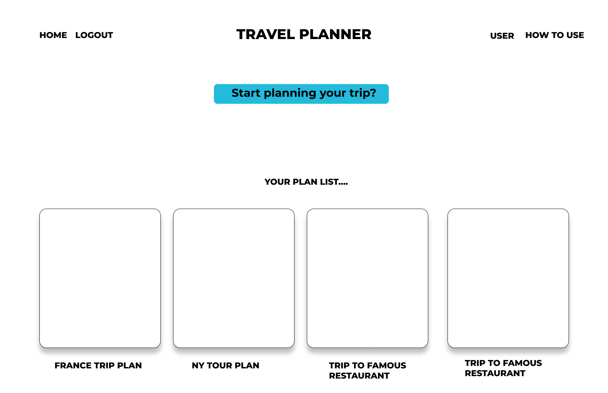
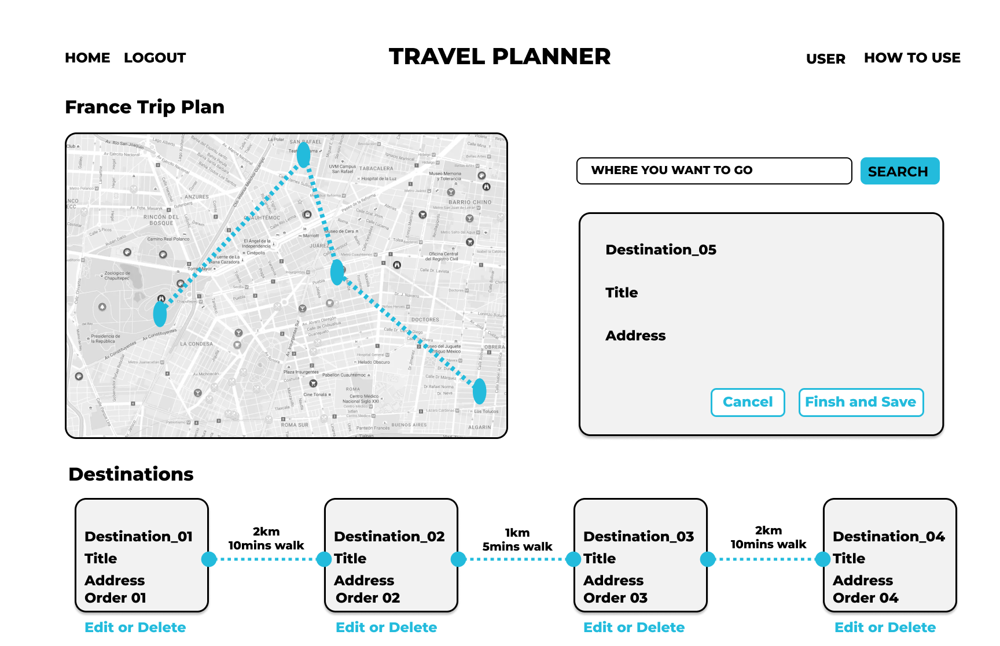
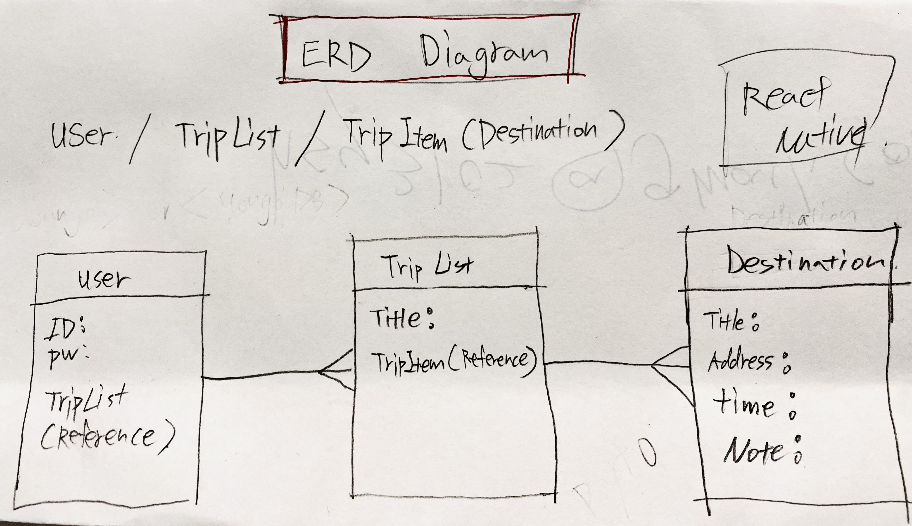
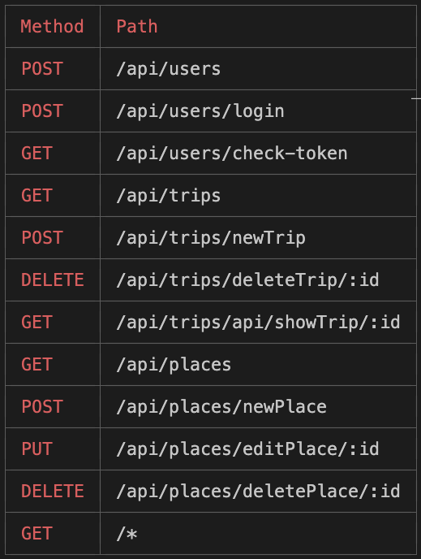

## Premise: 

Plan your trip with Tripplan!
This is a trip planning app, a place where you can create trips,destinations and see the distance between destinations. Plan your trip conveniently with Tripplan.
 
Happy planning!

## Getting started:
[Link to the APP](https://tripnote.herokuapp.com//)

[Link to Trello board](https://trello.com/b/5EkXJrqq/sei-59project-04)

## User Story:

- Users should be able to create their own profiles to get access to their trip plans.
- Users should be able to create, edit and delete their own trip plans.
- Users should also be able to check trip distance and time between destinations.

## Wireframes:
 

Concept idea for the homepage.

Concept ideas for the Trip index page.

Concept ideas for the destination page.

## The ERD: 

The proposed ERD for the project *(entity relationship diagram)*

## Route Table:

 
List of the routes used.

## Technologies Used:
- JavaScript
- Css
- Mongodb
- Node.js
- Express
- React
- MERN

## Future goals:
- [x] Connect an api to add todos onto a calendar
- [ ] Dark mode

